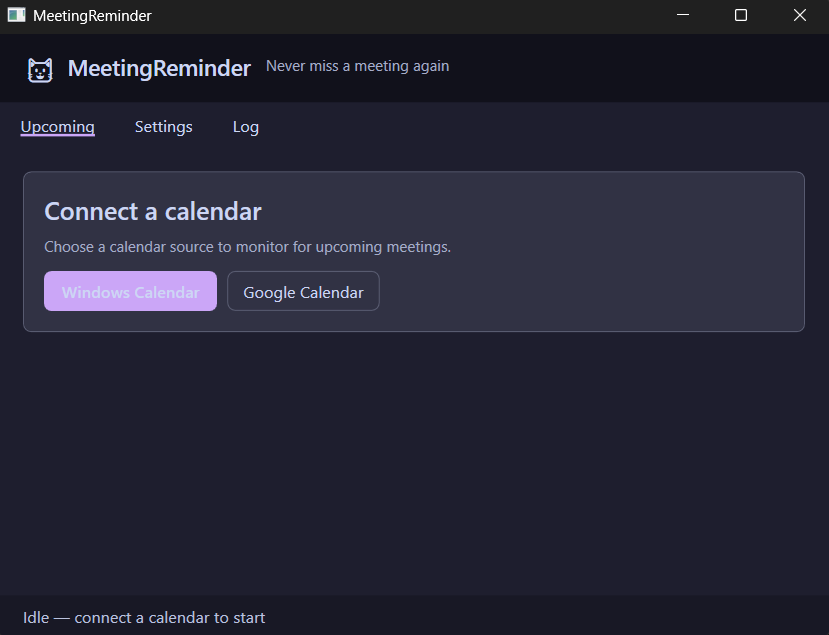
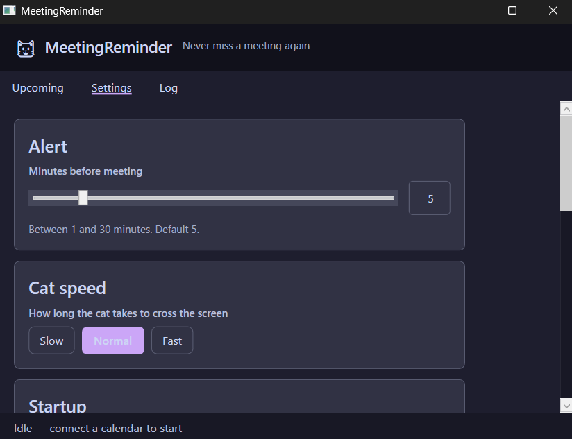

<div align="center">


# MeetingReminder — Windows

**A Catppuccin-themed cat flies across your screen before every meeting.**

[](https://github.com/ItsVik03/meeting-reminder-win)
[](https://dotnet.microsoft.com/)
[](https://github.com/ItsVik03/meeting-reminder-win)
[](LICENSE)
[](https://github.com/ItsVik03/meeting-reminder-win/stargazers)

[**Live Demo**](https://itsvik03.github.io/meeting-reminder-win) · [**Report Bug**](https://github.com/ItsVik03/meeting-reminder-win/issues) · [**Request Feature**](https://github.com/ItsVik03/meeting-reminder-win/issues)

<br/>



</div>

---

## What it does

5 minutes before your meeting — a cat flies across your screen trailing a banner with your meeting title. No more "oops, forgot the standup."

- Polls your calendar every **60 seconds**
- Shows the cat animation **~5 minutes** before each event
- Sits quietly in the **system tray** when you don't need it
- Works with **Google Calendar** and **Windows Calendar** (Outlook, iCloud, Exchange)

---

## Screenshots

<div align="center">

| Main Window | Settings |
|:-----------:|:--------:|
|  |  |

</div>

---

## Features

- 🐱 **Flying cat animation** — Catppuccin-themed cat mascot with meeting banner
- 📅 **Google Calendar** — Direct OAuth2 integration, tokens cached locally
- 🗓️ **Windows Calendar** — WinRT Appointments API (Outlook.com, iCloud, Exchange)
- 🎨 **Catppuccin theming** — Mocha (dark) and Latte (light), 14 accent colours
- 🔔 **Smart alerts** — Configurable 1–30 min advance warning, no duplicate alerts
- 🖥️ **System tray** — Runs silently in background, right-click for quick actions
- ⚡ **Start with Windows** — Auto-launch support via registry
- 📋 **In-app log** — Rolling daily logs, auto-pruned after 30 days

---

## Requirements

- Windows 10 (1809+) or Windows 11
- [.NET 8 SDK](https://dotnet.microsoft.com/download/dotnet/8) or later
- A Google account with OAuth2 credentials **or** Windows Calendar with an account

---

## Installation

### Option 1 — Build from source (recommended for learning)

```bash
git clone https://github.com/ItsVik03/meeting-reminder-win.git
cd meeting-reminder-win
dotnet build
dotnet run --project MeetingReminder.App
```

### Option 2 — Build scripts

| Command | What it does |
|---------|--------------|
| `build.bat` | Debug build |
| `build.bat release` | Release build |
| `build.bat test` | Build + run xUnit tests |
| `build.bat publish` | Self-contained single-file exe (win-x64) |
| `build.bat msix` | Full MSIX pipeline |
| `build.bat clean` | Wipe bin/obj |

---

## Google Calendar Setup

> You need OAuth2 credentials from Google Cloud Console. This is a one-time setup.

1. Go to [Google Cloud Console](https://console.cloud.google.com)
2. Create a new project → name it anything (e.g. `MeetingReminder`)
3. Navigate to **APIs & Services → Library** → enable **Google Calendar API**
4. Go to **APIs & Services → Credentials → Create Credentials → OAuth 2.0 Client ID**
5. Choose **Desktop application** → click Create
6. Copy your **Client ID** and **Client Secret**
7. Open the app → **Settings → Google Calendar** → paste both values → click **Connect**
8. Sign in via your browser — tokens are cached locally, you only do this once

> ⚠️ Never commit your `client_secrets.json` to GitHub. It's already in `.gitignore`.

---

## Customization

| Setting | Location |
|---------|----------|
| Alert timing (1–30 min) | Settings → Alert slider |
| Flight speed (Slow / Normal / Fast) | Settings → Cat speed |
| Theme (Mocha / Latte) | Settings → Appearance |
| Accent colour (14 options) | Settings → Accent picker |
| Start with Windows | Settings → Startup |
| Start minimised to tray | Settings → Startup |

---

## Project Structure

```
meeting-reminder-win/
├── MeetingReminder.App/        # WPF application (UI, views, services)
│   ├── Assets/                 # Cat mascot images
│   ├── Themes/                 # Catppuccin Mocha + Latte palettes
│   ├── Services/               # Calendar, tray, theme, notification
│   └── ViewModels/             # MVVM (CommunityToolkit.Mvvm)
├── MeetingReminder.Core/       # Platform-agnostic logic
│   ├── Models/                 # AppConfig, CalendarEvent
│   ├── CalendarPoller.cs       # 60s polling + alert dedup
│   └── ConfigService.cs        # JSON config at %LOCALAPPDATA%
├── MeetingReminder.Tests/      # xUnit tests
├── assets/                     # Screenshots + repo images
└── scripts/                    # Build + MSIX packaging scripts
```

---

## How It Works

```
Every 60s → Fetch next hour of events
         → Check if any event starts in ~5 min
         → If yes (and not already alerted) → fly the cat
         → Cat: borderless transparent WPF window
                slides from off-left to off-right
                fades out at the end
```

Credentials and config are stored at `%LOCALAPPDATA%\MeetingReminder\` — never inside the project folder, never on GitHub.

---

## Contributing

Pull requests are welcome! For major changes, open an issue first.

```bash
# Fork the repo
git checkout -b feature/your-feature-name
git commit -m "Add: your feature description"
git push origin feature/your-feature-name
# Open a Pull Request
```

---

## License

MIT — see [LICENSE](LICENSE) for details.

---

<div align="center">

Built by [ItsVik03](https://github.com/ItsVik03) 

</div>
